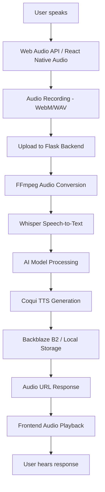

# 🎤 ValiNul Voice-to-Voice Feature

A complete voice-to-voice conversational AI system that enables natural spoken interactions with the ValiNul AI Assistant.

## ✨ Features

### 🎯 Core Functionality
- **Speech-to-Text**: Convert spoken words to text using OpenAI Whisper
- **AI Processing**: Process transcribed text with existing AI models
- **Text-to-Speech**: Generate natural-sounding voice responses using Coqui TTS
- **Auto-Play**: Automatically play AI voice responses
- **Real-time Feedback**: Visual indicators for recording, processing, and playback

### 🌐 Cross-Platform Support
- **Web (React.js)**: Works in modern browsers with WebRTC support
- **Android (React Native)**: Native mobile app with permission handling
- **Shared Components**: Code reuse between web and mobile platforms

### 🔊 Audio Features
- **Multiple Formats**: Supports WebM, WAV, MP3, M4A, OGG audio files
- **High Quality**: 16kHz mono audio for optimal processing
- **Smart Compression**: Automatic audio optimization for faster processing
- **Cloud Storage**: Optional Backblaze B2 integration for audio files

### 🛡️ Privacy & Security
- **Session-based**: Secure authentication with existing user system
- **Temporary Storage**: Audio files automatically cleaned up
- **Local Fallback**: Works without cloud storage if needed
- **HTTPS Ready**: Production-ready security implementation

## 🚀 Quick Start

### Prerequisites
- Python 3.8+ with Flask backend running
- Node.js 16+ for React frontend
- FFmpeg for audio processing
- 4GB+ RAM (for TTS model)

### 1. Backend Setup
```bash
cd backend
pip install -r requirements_voice.txt
python setup_voice_dependencies.py
python app.py
```

### 2. Frontend Setup
```bash
cd frontend
npm install react-native-web react-native-audio-recorder-player
npm start
```

### 3. Test Voice Features
1. Open the React app in your browser
2. Click the "Voice Mode" toggle in the header
3. Grant microphone permissions
4. Click the microphone button and speak
5. Listen to the AI voice response

## 🏗️ Architecture



## 📁 File Structure

```
backend/
├── voice_service.py         # Core voice processing logic
├── voice_routes.py          # Flask API endpoints
├── voice_config.py          # Configuration settings
├── setup_voice_dependencies.py  # Automated setup script
├── test_voice_functionality.py  # Testing utilities
└── requirements_voice.txt   # Python dependencies

frontend/src/components/
├── VoiceRecorder.js         # Cross-platform voice recorder
├── VoiceChat.js            # Android-specific chat interface
├── Chat.js                 # Updated web chat with voice
└── ChatMessage.js          # Enhanced messages with audio

documentation/
├── VOICE_TO_VOICE_SETUP.md  # Complete setup guide
└── VOICE_README.md          # This file
```

## 🎛️ API Endpoints

### Voice Processing
- `POST /api/voice/transcribe` - Convert audio to text
- `POST /api/voice/synthesize` - Convert text to speech
- `POST /api/voice/process` - Complete voice-to-voice pipeline
- `GET /api/voice/status` - Check service status
- `GET /api/voice/audio/<filename>` - Serve audio files

### Example Usage
```javascript
// Complete voice-to-voice interaction
const formData = new FormData();
formData.append('audio', audioBlob, 'voice_input.webm');

const response = await fetch('/api/voice/process', {
    method: 'POST',
    credentials: 'include',
    body: formData
});

const result = await response.json();
// result.transcription.text - what user said
// result.response.audio_url - AI voice response
```

## 🎨 UI Components

### Voice Mode Toggle
Switches between text and voice interaction modes:
```jsx
<button onClick={toggleVoiceMode}>
    {voiceMode ? 'Voice Mode' : 'Text Mode'}
</button>
```

### Voice Recorder
Cross-platform recording component:
```jsx
<VoiceRecorder
    onRecordingComplete={handleAudioBlob}
    onTranscriptionReceived={handleTranscription}
    onError={handleError}
    maxDuration={300}
    autoTranscribe={true}
/>
```

### Enhanced Chat Messages
Messages with voice indicators and playback:
- 🎤 Green indicator for voice input messages
- 🎧 Purple indicator for voice response messages
- ▶️ Play button for audio responses
- Confidence scores for transcriptions

## ⚙️ Configuration

### Environment Variables
```bash
# Whisper Settings
WHISPER_MODEL=base                    # tiny, base, small, medium, large
WHISPER_DEVICE=cpu                    # cpu or cuda

# TTS Settings
TTS_MODEL=tts_models/en/ljspeech/tacotron2-DDC
TTS_DEVICE=cpu
TTS_SPEED=1.0

# Audio Settings
AUDIO_SAMPLE_RATE=16000
AUDIO_CHANNELS=1
MAX_AUDIO_LENGTH=300

# Backblaze B2 (Optional)
B2_APPLICATION_KEY_ID=your_key_id
B2_APPLICATION_KEY=your_application_key
B2_BUCKET_NAME=valinul-audio
```

### Model Options

#### Whisper Models (Speed vs Accuracy)
- `tiny` - ~1GB, fastest, less accurate
- `base` - ~1GB, good balance (recommended)
- `small` - ~2GB, better accuracy
- `medium` - ~5GB, high accuracy
- `large` - ~10GB, highest accuracy

#### TTS Models
- `tacotron2-DDC` - Fast, good quality (recommended)
- `tacotron2-DCA` - Slower, higher quality
- `glow-tts` - Very fast, lower quality

## 🔧 Customization

### Adding New Languages
```python
# In voice_service.py
def transcribe(self, audio_path: str, language: str = None):
    result = self.model.transcribe(
        audio_path,
        language=language,  # 'es', 'fr', 'de', etc.
        fp16=False
    )
```

### Custom TTS Voices
```python
# In voice_service.py - TTS model selection
self.tts = TTS(
    model_name="tts_models/en/ljspeech/tacotron2-DDC",
    # Add custom voice models here
)
```

### Audio Format Support
```python
# In voice_routes.py - allowed extensions
ALLOWED_EXTENSIONS = {'wav', 'webm', 'mp3', 'm4a', 'ogg', 'flac'}
```

## 📊 Performance Optimization

### Backend Optimizations
- **Model Caching**: Keep models loaded in memory
- **Audio Caching**: Cache TTS results for common phrases
- **Async Processing**: Use background workers for long tasks
- **GPU Acceleration**: Use CUDA for faster processing

### Frontend Optimizations
- **Audio Compression**: Compress recordings before upload
- **Chunked Upload**: Split large audio files
- **Preloading**: Preload audio responses
- **Lazy Loading**: Load components on demand

### Recommended Settings
```python
# For development
WHISPER_MODEL = "tiny"      # Fast transcription
TTS_DEVICE = "cpu"          # No GPU required

# For production
WHISPER_MODEL = "base"      # Good accuracy
TTS_DEVICE = "cuda"         # GPU acceleration
MAX_CONCURRENT_REQUESTS = 3 # Limit resource usage
```

## 🐛 Troubleshooting

### Common Issues

#### "Microphone permission denied"
- Check browser microphone permissions
- Ensure HTTPS in production
- Try different browser

#### "Audio format not supported"
- Verify FFmpeg installation
- Check file extension in ALLOWED_EXTENSIONS
- Test with WAV files

#### "TTS model loading failed"
- Ensure 4GB+ RAM available
- Try smaller TTS model
- Check network connection for model download

#### "B2 storage connection failed"
- Verify API credentials
- Check bucket permissions
- Test with local storage first

### Performance Issues

#### Slow transcription
- Use smaller Whisper model
- Enable GPU if available
- Reduce audio file size

#### High memory usage
- Monitor TTS model memory
- Implement audio cleanup
- Use model quantization

### Testing Commands
```bash
# Test all voice functionality
python backend/test_voice_functionality.py

# Test specific components
python -c "from voice_service import voice_service; print('Voice service OK')"

# Check Flask endpoints
curl http://localhost:5000/api/voice/status
```

## 🚀 Production Deployment

### Docker Setup
```dockerfile
# Add to your Dockerfile
RUN apt-get update && apt-get install -y ffmpeg
COPY requirements_voice.txt .
RUN pip install -r requirements_voice.txt
```

### Environment Setup
```bash
# Production environment variables
export WHISPER_MODEL=base
export TTS_DEVICE=cpu
export B2_APPLICATION_KEY_ID=your_production_key
export B2_APPLICATION_KEY=your_production_secret
```

### Monitoring
- Monitor endpoint response times
- Track audio file storage usage
- Alert on transcription failures
- Monitor TTS generation times

## 🤝 Contributing

### Adding Features
1. Fork the repository
2. Create feature branch
3. Add voice functionality
4. Write tests
5. Submit pull request

### Code Style
- Follow existing Python/JavaScript conventions
- Add type hints for Python code
- Document new API endpoints
- Include error handling

### Testing
```bash
# Run voice functionality tests
python backend/test_voice_functionality.py

# Test React components
npm test VoiceRecorder
```

## 📜 License

This voice-to-voice feature is part of the ValiNul AI Assistant project and follows the same license terms.

## 🙏 Acknowledgments

- **OpenAI Whisper** - Speech-to-text processing
- **Coqui TTS** - Text-to-speech synthesis
- **Backblaze B2** - Cloud audio storage
- **React Native** - Cross-platform mobile development
- **Web Audio API** - Browser audio processing

---

**Ready to give your AI a voice?** 🎤✨

Follow the [complete setup guide](VOICE_TO_VOICE_SETUP.md) to get started!


